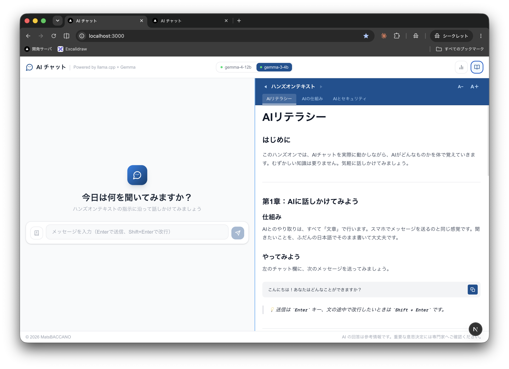

# AIチャット ハンズオン

生成AI研修向けの、完全ローカル環境で動作するAIチャットハンズオンツールです。インターネット接続不要で、[llama.cpp](https://github.com/ggml-org/llama.cpp) でホストしたローカルLLM（Gemma）と対話しながら、AIの基本的な仕組みからセキュリティ、推論・エージェントの考え方までを体験できます。



## 特徴

- **完全オフライン動作**：外部ネットワークへは一切通信しません。すべてローカルのllama.cppサーバーとのみ通信します
- **2モデル切り替え**：軽量モデルと高性能モデルを画面から切り替えて応答速度・回答の違いを比較できます
- **ハンズオンテキスト**：「AIリテラシー」「AIの仕組み」「AIとセキュリティ」「AIの推論とエージェント」の4章を、チャット画面と並べて閲覧しながら進行できます
- **推論モード**：モデルに思考過程（`<think>`）を明示させて表示します
- **RAG（社内資料を使った回答）**：`knowledge/`フォルダに置いた資料を検索し、根拠付きで回答します。外部ベクトルDBは使わず、埋め込み専用のllama-serverとインメモリ検索だけで完結します
- **プロンプト配信**：講師が`/presenter`で事前に用意したプロンプトを、演習のタイミングで受講者全員の画面へリアルタイムに配信できます。受講者はコピー&ペーストするだけで進められます
- **利用状況ダッシュボード**：受講者は自分の利用分（質問回数・トークン数・推定コスト・モデル別のコスト/速度比較）を`/analytics`で確認できます。会場全体の集計（カテゴリ別分析・RAG候補・自動化候補など、会話ログをLLM自身に分類させたもの）は講師向けに`/presenter`の「利用統計」タブへ分けて表示します
- **講師向け管理画面**：QRコードによる受講者向けURL共有、RAGの知識ソース管理、会場全体の利用統計をまとめた画面です。通常のナビゲーションには表示されないため、`/presenter` に直接アクセスしてください

## 動作要件

- Node.js 20 以上（ローカルで直接動かす場合。同梱の[Dockerfile](./Dockerfile)を使う場合はNode.js自体のインストールは不要）
- [llama.cpp](https://github.com/ggml-org/llama.cpp) の `llama-server` を2つ起動しておくこと（モデル1・モデル2）
- RAG機能を使う場合は、埋め込み専用の `llama-server` をもう1つ起動しておくこと（後述）

```bash
# 例
llama-server -m gemma-3-4b-it.gguf --port 8081
llama-server -m gemma-4-12b-it.gguf --port 8080
```

## セットアップ

```bash
npm install
cp .env.local.example .env.local   # 必要に応じて編集
npm run dev
```

http://localhost:3000 を開きます。

## 環境変数

`.env.local`（ローカル開発）または `.env`（Docker、`.env.example` を参照）に設定します。

| 変数 | 説明 | デフォルト |
|---|---|---|
| `LLAMA_API_URL` | モデル1のllama.cppサーバーURL | `http://localhost:8080` |
| `LLAMA_API_URL_2` | モデル2のllama.cppサーバーURL | `http://localhost:8081` |
| `LLAMA_MODEL` | llama.cppに渡すモデル名 | `gemma4` |
| `LLAMA_MODEL_LABEL_1` / `LLAMA_MODEL_LABEL_2` | 画面に表示するモデルの表示名 | モデル名から自動生成 |
| `LLAMA_MAX_TOKENS` | チャット1回あたりの生成トークン上限 | `2048` |
| `LLAMA_CLASSIFY_MAX_TOKENS` | 利用ログ分類リクエストのトークン上限 | `512` |
| `RAG_EMBED_API_URL` | 埋め込み用llama.cppサーバーURL | `http://localhost:8082` |
| `RAG_EMBED_MODEL` | 埋め込みAPIに渡すモデル名 | `embedding` |
| `RAG_KNOWLEDGE_DIR` | 知識ソースのフォルダ | `./knowledge` |
| `RAG_TOP_K` | 検索で取り出す件数 | `4` |
| `RAG_CHUNK_SIZE` / `RAG_CHUNK_OVERLAP` | チャンクの最大文字数 / 重なり文字数 | `500` / `100` |
| `RAG_MIN_SCORE` | この類似度未満のチャンクは不採用 | `0.3` |
| `RAG_EMBED_BATCH_SIZE` / `RAG_EMBED_TIMEOUT_MS` | 埋め込みのバッチ件数 / タイムアウト | `16` / `20000` |
| `RAG_EMBED_QUERY_PREFIX` / `RAG_EMBED_DOC_PREFIX` | 埋め込みモデルが要求するプレフィックス | 空文字 |
| `ANALYTICS_DB_PATH` | 利用統計SQLiteのファイルパス | `./data/analytics.db` |

## 開催実績

### 2026-09-18 社内研修（参加者30名）

参加者30名が各自の端末からこのアプリに同時接続し、AIチャットのハンズオンを
最後まで実施できました。以下の構成・設定で、再現できることを確認済みです。

| 項目 | 当日の構成・設定 |
|---|---|
| サーバー | Mac Studio（Apple M4 Max / 36GBユニファイドメモリ）1台 |
| アプリ | Docker（colima）上のこのアプリ（ポート8061）。`.env`は`.env.example`のまま |
| llama.cpp | `llama-server` version 9590（d2462f8f7、Homebrew版）、`launchd`で常駐 |
| モデル1（8080） | `gemma-4-E4B-it` Q4_K_M + mmproj Q8_0、`-ngl 999 --parallel 50 --ctx-size 204800` |
| モデル2（8081） | `gemma-3n-E4B-it` Q4_K_M、`-ngl 999 --parallel 50 --ctx-size 204800` |
| 埋め込み（8082） | `bge-m3` Q4_K_M、`--embeddings --pooling cls -ngl 999` |
| その他 | `iogpu.wired_limit_mb`はOS既定値のまま（変更なし） |

`--parallel`は参加者30名に対して余裕を持たせ50（1スロット4096トークン）で起動しています。
当日の利用状況（`/presenter`「利用統計」の元データより集計）:

- 実施時間: 9:54〜15:37、チャットリクエスト **820件、エラー0件**
  （モデル1: 172件、モデル2: 648件）
- ピーク: 1分あたり24リクエスト（10:30頃）
- 応答完了までの平均時間: モデル1 約118秒、モデル2 約54秒（ストリーミングの生成完了まで。
  長文生成や一斉送信時は数分かかる応答もあり、同時生成数が増えるほど1人あたりの速度は低下します）

同規模（〜50名）の研修を再度行う場合は、下記「[参加人数に合わせた設定手順](#参加人数に合わせた設定手順)」
で `scripts/llama-launchd.sh apply 50` を実行すれば当日と同じ設定になります。

## 複数人ハンズオンでのサーバー容量設計（参考値）

本番サーバーは **Mac Studio（Apple M4 Max / 36GBユニファイドメモリ）** で、
`launchd`（`~/Library/LaunchAgents/jp.co.occ.ted.llama-server*.plist`）経由で
以下の2モデルを常時起動しています。

- モデル1（ポート8080）: `gemma-4-E4B-it`（Q4_K_M、`--mmproj`にQ8_0の projector 込み）
- モデル2（ポート8081）: `gemma-3n-E4B-it`（Q4_K_M、テキストのみ）

以下はこの実機・実モデルに対して `--parallel` と `-c`（コンテキストサイズ）を変えながら
実測したメモリ使用量（RSS）をもとにした概算です。**llama.cppのバージョンやモデルを変更した
場合は、必ず本項の方法で再実測してください。**

### 前提・計算式

- コンテキストサイズは1スロットあたり `4096`（ハンズオンの往復会話には十分な量）で統一
- 実測モデル重み（mmap後のRSS、`-ngl 999`フル offload時）:
  gemma-4-E4B-it ≒ **5.49 GiB**（本体4.97GiB + mmproj 0.52GiB）、
  gemma-3n-E4B-it ≒ **3.95 GiB**
- 実測KVキャッシュコスト: gemma-4-E4B-it ≒ **0.015 MiB/トークン/スロット**、
  gemma-3n-E4B-it ≒ **0.008 MiB/トークン/スロット**
  （`--parallel`違い・`--ctx-size`違いの4パターンずつRSSを実測し、差分から算出）
- 計算バッファ（並列数に応じて増える分）: gemma-4-E4B-it ≒ 0.24GiB + 0.04GiB×並列数、
  gemma-3n-E4B-it ≒ 0.11GiB + 0.03GiB×並列数
- 必要メモリ ≒ OS分(5GiB、両モデル共通で1回のみ) + Σ各モデル(モデル重み + 計算バッファ +
  並列数 × 4096 × KVキャッシュコスト)

### 参考値（モデル単体・`-c 4096`固定、`--parallel`＝参加人数）

| 参加人数 | モデル | 推定必要メモリ（単体） |
|---|---|---|
| 10名 | gemma-3n-E4B-it | 約9.7 GiB |
| 10名 | gemma-4-E4B-it | 約11.8 GiB |
| 30名 | gemma-3n-E4B-it | 約11.0 GiB |
| 30名 | gemma-4-E4B-it | 約13.8 GiB |
| 50名 | gemma-3n-E4B-it | 約12.2 GiB |
| 50名 | gemma-4-E4B-it | 約15.8 GiB |

### 両モデル同時起動時（本番構成）の合計

| 参加人数（両モデルとも同数と仮定） | 推定必要メモリ（合計） |
|---|---|
| 10名 | 約16.4 GiB |
| 30名 | 約19.7 GiB |
| 50名 | 約23.0 GiB |

以前（開発用MacBook上での見積もり）は、モデルサイズがより大きい旧モデル（gemma-3-4b／
gemma-4-12b想定）を前提にしていたため「重いモデルは50名だと単独でも入らない」という結論
でしたが、**本番で実際に使っているgemma-4-E4B-it／gemma-3n-E4B-itはどちらもかなり小型で、
Mac Studio（36GB）なら50名規模でも両モデルを同時にフル並列で立てたままで十分収まります**
（合計約23GiB、OS・他アプリ分を差し引いても余裕があります）。

**2026-09-10時点で、両モデルとも参加50名想定で`--parallel 50`・`--ctx-size 204800`
（＝1スロット4096トークン×50）に設定済みです**（`~/Library/LaunchAgents/jp.co.occ.ted.llama-server.plist`
／`jp.co.occ.ted.llama-server-gemma3n.plist`）。実機で起動確認したところ、RSSは
gemma-4-E4B-it ≒ 10.86 GiB、gemma-3n-E4B-it ≒ 7.24 GiB（合計 約18.1 GiB）で、
上記の見積もりとほぼ一致し、36GBのうち十分な余裕を確認済みです。この設定で2026-09-18に
30名規模のハンズオンを実施しました（[開催実績](#開催実績)）。

### 参加人数に合わせた設定手順

launchdのplistは [`deploy/launchd/`](./deploy/launchd/) にテンプレートとして管理しており、
[`scripts/llama-launchd.sh`](./scripts/llama-launchd.sh) で参加人数を指定して生成・再読み込みできます。
`--parallel`＝参加人数、`--ctx-size`＝参加人数×4096（1スロット4096トークンを維持）に自動設定されます。

```bash
scripts/llama-launchd.sh status              # 現在の --parallel / --ctx-size / RSS / 稼働状況を確認
scripts/llama-launchd.sh estimate 30         # 必要メモリの見積もりだけを表示（上記の計算式）
scripts/llama-launchd.sh apply 50 --dry-run  # 変更内容の差分だけを表示（何も変更しない）
scripts/llama-launchd.sh apply 50            # plistを配置して、変更があったサーバーだけ再起動
```

- `apply`は既存のplistを`*.plist.bak.<日時>`に退避してから上書きし、各サーバーの`/health`が
  応答するまで待ちます。見積もりが搭載メモリを超える人数は拒否します
- 当日と同じ設定にするには `apply 50`（2026-09-18の実績値）。参加人数ちょうどではなく、
  途中参加やタブの二重接続を見込んで多めに設定するのがおすすめです
- 別のMacに構築する場合も、モデルを `~/Models/llama.cpp/` 配下に同じ構成で置けば
  そのまま使えます。配置先が異なる場合は `MODELS_DIR=/path/to/models`、
  `llama-server`の場所が異なる場合は `LLAMA_SERVER_BIN=/path/to/llama-server` を付けて実行してください
- 研修の前日までに `apply` → `status` で全サーバーが `{"status":"ok"}` になることを確認し、
  可能であれば数名で同時にチャットして応答を確かめておくと安心です

またApple SiliconはGPU（Metal）が使えるメモリに既定の上限があるため、`--parallel`を大きく
増やす場合は事前に上限を引き上げてください（現状 `iogpu.wired_limit_mb=0` ＝OS既定値のまま。
50名設定・合計約18GiB使用の範囲では既定値のままで問題なく起動できています）。

```bash
sudo sysctl iogpu.wired_limit_mb=<引き上げたい上限(MB)>
```

## RAG（社内資料を使った回答）

`knowledge/` フォルダに `.md` / `.txt` ファイルを置くと、チャットが自動でその内容を
検索し、根拠付きで回答します。外部ベクトルDB・LangChain等は使わず、埋め込み専用の
`llama-server` とインメモリのコサイン類似度検索だけで完結します（詳しくは
[`knowledge/README.md`](./knowledge/README.md) を参照）。

### 埋め込みサーバーの起動

事前に埋め込み用のGGUFモデルを用意し、通常のチャット用とは別に3つ目の
`llama-server` を起動します。以下は動作確認済みの例（[bge-m3](https://huggingface.co/bbvch-ai/bge-m3-GGUF)、日本語を含む多言語対応・1024次元）です。

```bash
llama-server --hf-repo bbvch-ai/bge-m3-GGUF --hf-file bge-m3-q4_k_m.gguf \
  --embeddings --pooling cls --host 127.0.0.1 --port 8082 \
  -c 4096 -b 4096 -ub 4096 -ngl 99
```

完全オフライン環境では `--hf-repo`/`--hf-file` によるダウンロードができないため、
研修当日までにモデルファイルを入手し、ローカルパス指定（`-m /path/to/model.gguf`）
に切り替えてください。

### 使い方

1. `knowledge/` フォルダに資料(`.md` / `.txt`)を置く
2. チャット画面の「RAG」トグルをONにする（知識ソースが1件も無いと押せません）
3. 質問すると、資料を検索した上で回答し、回答の下に「参照した資料」パネルが表示されます
4. ファイルを追加・変更した直後にすぐ反映したい場合は、`/presenter` の
   「知識ソースを再読み込み」ボタンを押してください（何もしなくても次の質問から
   自動で反映されます）

### 仕組み（ベクトルDBは使っていません）

RAG＝ベクトルDBと思われがちですが、RAGの定義は「生成前に関連文書を検索してプロンプトに
注入する」ことだけで、検索方法自体は問いません。このアプリは、知識ソースが数十〜数百
チャンク程度の研修デモ規模であることを前提に、ベクトルDB・ANN(近似最近傍探索)インデックス
を一切使わず、**全チャンクをメモリに載せて毎回総当たりでコサイン類似度を計算する**方式を
採っています。

1. **インデックス構築**（`lib/rag/indexer.ts`）: `knowledge/` 配下のファイルを読み込み、
   見出し単位でチャンク分割（`lib/rag/chunk.ts`）した上で、各チャンクの本文を埋め込み専用の
   `llama-server`（bge-m3）に送ってベクトル化。ベクトルはL2正規化した上で、チャンク本文と
   ともに `globalThis` 上の配列に保持するだけ（DBもファイルも使わない。サーバー再起動で
   消えるが次のリクエストで自動的に作り直される）
2. **検索**（`lib/rag/search.ts`）: 質問文も同じ埋め込みサーバーでベクトル化し、保持している
   全チャンクのベクトルと1件ずつ内積を取る（ベクトルは正規化済みなので内積＝コサイン類似度）。
   しきい値(`RAG_MIN_SCORE`)未満を除外してスコア降順に並べ、上位`RAG_TOP_K`件だけを残す
   ——ANNインデックスを使わないO(n)の線形探索
3. **生成への注入**（`app/api/chat/route.ts`）: 検索結果のテキストを
   `[資料1] タイトル\n本文...` の形でsystemプロンプトに文字列として連結してから、通常の
   チャットと同じように `/v1/chat/completions` へ渡す

```
質問文 → 埋め込みサーバーでベクトル化 → 全チャンクと内積計算(線形探索)
       → スコア上位N件 → systemプロンプトに連結 → LLMが回答生成
```

ベクトルDBが担うのは「大量のベクトルから高速に近傍を探す」ためのインデックス構造で、
研修デモの規模ではその問題自体が発生しないため、あえて導入していません。

## プロンプト配信

受講者が「プロンプトを自分で考えて入力する」ことに慣れていないうちは、講師が事前に
用意したプロンプトをその場で配信し、受講者はコピー&ペーストするだけで演習を進められます。

### 使い方

1. `/presenter` の「プロンプト配信」タブで、演習用のプロンプトをあらかじめ作成・保存しておく
2. 演習のタイミングで一覧の「配信」ボタンを押すと、受講者全員のチャット画面にリアルタイムで
   モーダルが表示されます（`EventSource`によるSSE配信。接続が途切れても自動的に再接続します）
3. 受講者はモーダルの「コピー」でプロンプトをコピーして入力欄に貼り付けるか、
   「入力欄に入れる」で直接反映できます。モーダルを閉じても、入力欄付近の
   「📣 講師からのプロンプトを見る」ボタンから見返せます
4. 次のプロンプトを配信すると前の内容は自動的に置き換わります（常に最新1件のみ配信）。
   「配信を取り下げる」でいつでも非表示にできます

配信中の受講者接続数は「プロンプト配信」タブに表示されます。プロンプトの一覧自体は
`./data/presenter-prompts.json` に保存され、サーバーを再起動しても残ります（配信状態自体は
再起動でクリアされます）。

## Dockerで動かす

このアプリ自体をコンテナ化し、[llama.cpp](https://github.com/ggml-org/llama.cpp)の`llama-server`（モデル1・モデル2、RAGを使うなら埋め込み用も）はホスト側で起動しておく構成を想定しています。

```bash
cp .env.example .env   # llama.cppのURLやモデル名を必要に応じて編集
docker compose up -d --build
```

http://localhost:8061 を開きます。

- ホスト側で動かしているllama.cppへは既定で `host.docker.internal` 経由でアクセスします。Docker Desktop（Mac/Windows）では標準で解決できますが、Linux上のDocker Engineでも動くよう`docker-compose.yml`で`extra_hosts`を設定済みです
- `knowledge/`フォルダはボリュームマウントされるため、イメージを作り直さなくても資料の追加・変更を反映できます（次の質問から自動的に反映されるか、`/presenter`の「知識ソースを再読み込み」で即時反映できます）
- `.env`に設定した変数は、[環境変数](#環境変数)の表にある項目も含めてすべて`docker-compose.yml`経由でコンテナに渡されます

### 運用上の注意（永続化とインメモリ状態）

- **`/presenter`の「利用統計」タブ（会場全体の集計）はSQLiteに永続化されます**（`./data/analytics.db`、`docker-compose.yml`で`./data`をボリュームマウント済み）。コンテナを再作成しても消えません。セッションID・プロンプト本文・応答本文など個人を特定できる情報は保存せず、トークン数・コスト・レイテンシ・LLMによる分類結果（カテゴリ等の集計値のみ）だけを保存します
- **「プロンプト配信」タブで作成したプロンプトの一覧はJSONファイルに永続化されます**（`./data/presenter-prompts.json`、同じく`./data`をボリュームマウント済み）。コンテナを再作成しても消えません
- **`/analytics`（受講者個人の利用分）はサーバーに一切保存されません。** チャットAPIがやり取りごとの実績値をブラウザに返し、そのブラウザの`localStorage`だけに積み上げて表示します。ブラウザを変える・ストレージを消すと個人統計は消えます（意図的な仕様です）
- 以下はサーバープロセスのメモリ上にのみ保持され、**コンテナを再起動すると失われます**（研修1回分のセッション内で完結させる設計であり、意図的な仕様です）
  - 管理者による「モデル1の一時停止」設定（`/presenter`）
  - RAGのベクトルインデックス（これは次回のリクエストで自動的に再構築されるため実害はありません）
  - 「アクティブ利用セッション数」の集計（セッションIDそのものを永続化しない設計のため、この指標だけは非永続）
  - 現在配信中のプロンプト（プロンプトの一覧自体は永続化されますが、「今何を配信しているか」は
    セッション限りの状態です。再起動後は改めて「配信」ボタンを押してください）

### よく使うコマンド

```bash
docker compose logs -f app    # ログを見る
docker compose down           # 停止・削除
docker compose up -d --build  # コードや.envの変更を反映して再起動
```

## 開発

```bash
npm run lint        # ESLint
npx tsc --noEmit     # 型チェック
npm run build        # 本番ビルド
```

## ライセンス

MIT License. 詳細は [LICENSE](./LICENSE) を参照してください。
